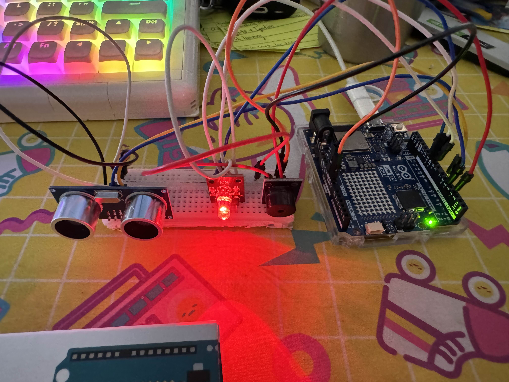

# Vehicle Backup Sensor

## Overview
This project is a **vehicle backup sensor** built with an Arduino UNO R4 WiFi, an **ultrasonic distance sensor**, an **RGB LED**, and a **passive buzzer**. The system continuously monitors the distance to nearby objects. When an object is within 15 cm, the LED turns green to indicate caution. As the object approaches closer than 3 cm, the LED changes to red and the buzzer emits a warning tone, alerting the user that the object is dangerously close.

## Features

- **Distance monitoring**: Continuously measures the distance to objects using an ultrasonic sensor.
- **Visual alert**:  
  - **Green LED**: Object detected within 15 cm (caution).  
  - **Red LED**: Object detected within 3 cm (danger).
- **Audible alert**: Passive buzzer sounds when an object is dangerously close (<3 cm).
---

## Hardware Components
| Component | Quantity | Notes |
|-----------|----------|-------|
| Arduino UNO R4 WiFi | 1 | Main controller |
| HC-SR04 Ultrasonic Distance Sensor | 1 | Measures distance |  
| RGB LED | 1 | Distance indication through light |
| Passive Buzzer | 1 | Produces warning tone |  

## How It Works

1. The ultrasonic sensor continuously measures the distance to the nearest object.  
2. If the distance is less than 15 cm, the **LED turns green**.  
3. If the distance drops below 3 cm, the **LED turns red** and the **buzzer sounds** to alert the user.  
4. The system updates the LED and buzzer status in real-time for continuous feedback.
---

## Usage

1. Connect the ultrasonic sensor, RGB LED, and passive buzzer to the Arduino UNO R4 WiFi according to the pin configuration in the code.  
2. Upload the provided Arduino sketch.  
3. Place the sensor near the back of the vehicle or model system.  
4. The system will automatically provide visual and audible alerts based on object distance.

---

## Quick Start
1. Connect all sensors and relay as shown above.  
2. Upload the Arduino code to the microcontroller.  
3. Connect all components to respective pins 
4. Power the microcontroller and check Serial Monitor for sensor readings.  
5. Adjust thresholds and test to see if it works.
